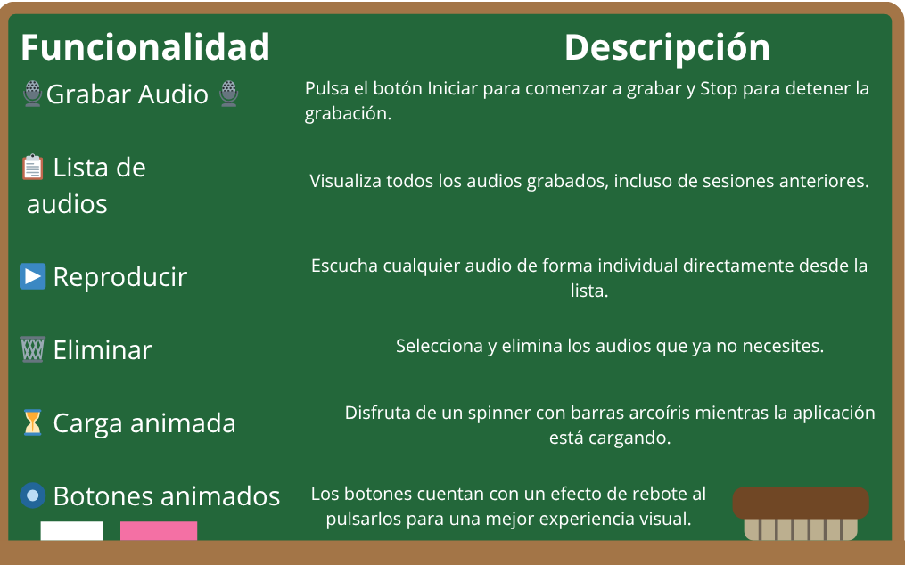
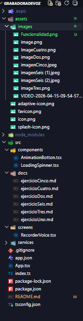
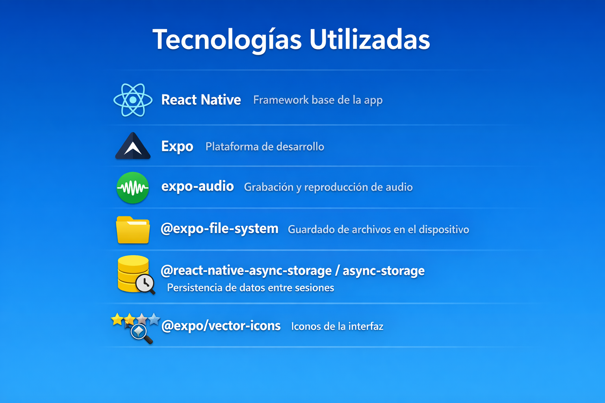
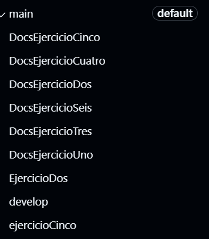
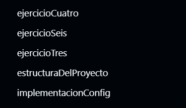

# PGL - Grabadora de voz.
Aplicacion diseñada para movil de una grabadora de voz, utilizando React Native + Expo. Utilizando sus librerias correspondiente para la practica.

## Funcionamiento de la aplicación.

Esta aplicacion permite al usuario grabar audios desde su movil, guardardolos de forma permanente y luego poder reproducirlos cuando quieras. Los audios se consevan entre sesiones gracias a `AsyncStorage` y `expo-file-system.`

## Funcionalidades de la aplicacion.

# Documentacion de cada ejercicio.

**1.- Diseño de Pantalla** [Documento ejercicio 1](src/docs/ejercicioUno.md)

**2.- App funcional** [Documento ejercicio 2](src/docs/ejercicioDos.md)

**3.- Permisos de micrófono** [Documento ejercicio 3](src/docs/ejercicioTres.md)

**4.- Guardado de audios** [Documento ejercicio 4](src/docs/ejercicioCuatro.md)

**5.- Componente Animado de carga** [Documento ejercicio 5](src/docs/ejercicioCinco.md)

**6.- Componente de animacion propio** [Documento ejercicio 6](src/docs/ejercicioSeis.md)

## Estructura del proyecto.

## Tecnologias utilizadas.

## Ejecutar el proyecto.

**Clonar Repositorio**  -> https://github.com/GabrieelDGM/UD4-Practica1-Grabadora-de-audio.git

**Entrar a la Carpeta** -> Grabadora de voz

**Instala las dependecias** -> npm install

**Arranca la App** -> npm star/npm expo start/ npx expo start.

## Flujo de trabajo

Se utilizaron ramas de git para realizar el flujo de trabajo de manera ordenada.

## Estudiante y creado de la aplicación.
**Gabriel David Gelviz Monterrey**

