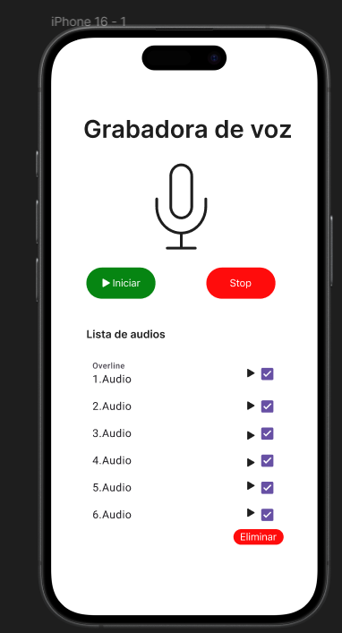

# Ejercicio 2 - Implementacion del diseño.

## Objetivo
Se creo la pantalla principal de la grabadora de voz.
[Pantalla Inicial](../screens/RecorderVoice.tsx)

## Elementos que se implemento

* Titulo.
* Icono de micfrono.
* Botón de iniciar.
* Botón de stop.
* Lista de audios para reproducir y eliminar.
* Botón de eliminar.

## Componentes de React Native utilizados

* `View` -> Para el contenedor principal
* `ScrollView` - > Para hacer un scroll si hay muchos audios
* `Tex` -> Para los textos
* `TouchableOpacity` -> Para todos los botones
* `StyleSheet` -> Para los estilos de cada clase.

## Captura de pantalla

[Volver al README](../../README.md)