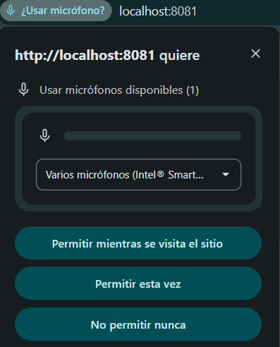

# Ejercicio 3 - Implementacion de permisos para grabar audio.

## Descripción
SE añadio la solicitud para permiso de microfono cada vez que quieras grabar un audio. usamos. `AudioModule.requestRecordingPermissionsAsync()`, para realizar esta funcion.

## Su funcionalidad
Usando el boton de iniciar, la app solicitar el permiso del micrófono para poder grabar, tenemos que aceptar para que comience la grabacion al contario no funcionara y si quieres parar la grabacion pulsas el boton de Stop

## Liberoas utilizadas.
`expo-audio`
`useAudioRecorder`
`AudioModule`
`RecordingPresets`

## Solicitud del micrófono

[Volver al README](../../README.md)