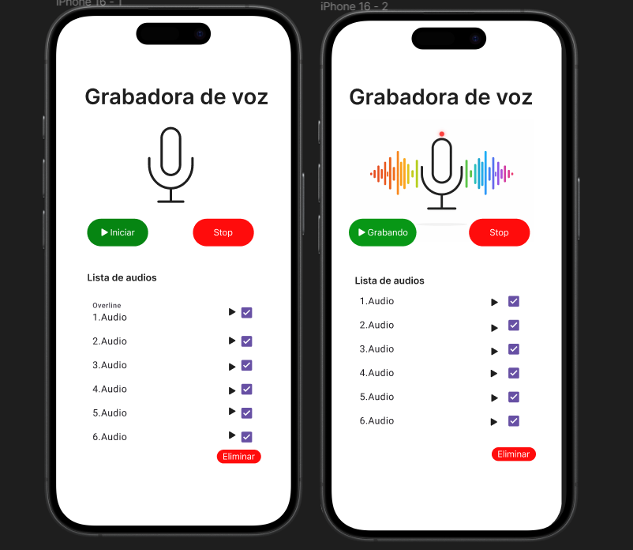
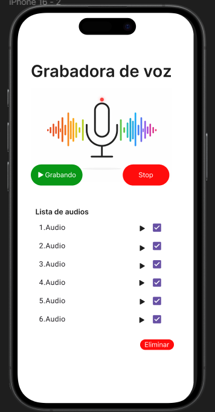

# Ejericio 1 Diseño de la pantalla de grabación

# Descripción

Se realizo el diseño de la pantalla de grabacion con su contenido correspodiente 

**Botón Iniciar →**Comienza a grabar el audio.
**Botón Stop →** Detiene la grabación del audio.
**Indicador de grabación →**Animación con ondas para verificar que se está grabando.
**Lista de audios →** Se muestran todos los audios grabados.
**Botón de reproducción →** Botón para reproducir cada audio de manera independiente.
**Botón Eliminar →** Botón para eliminar los audios seleccionados.

# Diseño.

### Pantalla Inicio Estado Normal.

## Pantalla Inicio Estado Grabando.

[Volver al Readme.](../../README.md)